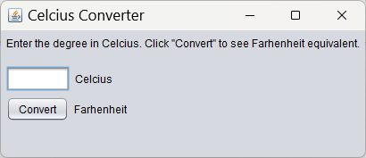
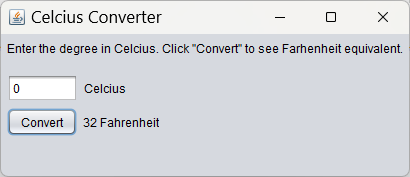
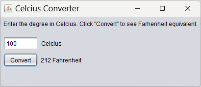
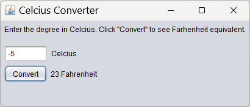

[Back to Portfolio](./)

Temperature Converter
===============

-   **Class: CSCI 325** 
-   **Grade: A** 
-   **Language(s): Java** 
-   **Source Code Repository:** [/lostinlaland/statisticsCalculator325](https://github.com/lostinlaland/temperatureConverter)  
    (Please [email me](mailto:lakirbymail.com?subject=GitHub%20Access) to request access.)

## Project description

A temperature is added to the user input box on the screen. This temperature (as noted next to the input field) is assumed to be in Celcius. When the user clicks on the "Convert" button the program converts the Celcius temperature into the corresponding Fahrenheit temperature. The result is output to the screen between the "Convert" button and Fahrenheit tag.
## How to compile and run the program

How to run the program.

```bash
cd ./dir
java -jar "CelciusConverterProject.jar" 
```

## UI Design

This program allows the user to input any temperature in Celcius and after they click on the "Convert" button the corresponding temperature in Fahrenheit will appear.


  
Fig 1. The launch screen

  
Fig 2. Output in Celcius after entering in 0° Fahrenheit.

  
Fig 3. Output in Celcius after entering in 100° Fahrenheit.

  
Fig 4. Output in Celcius after entering -5° Fahrenheit.


[Back to Portfolio](./)
