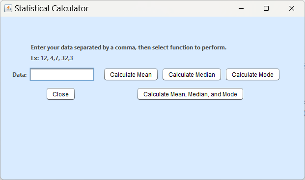
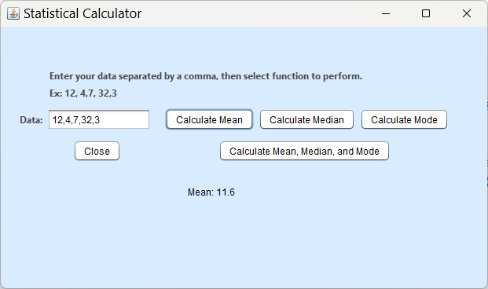
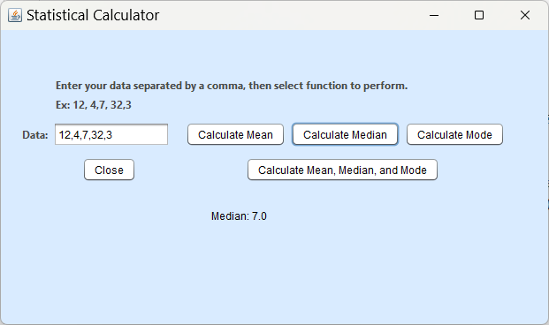
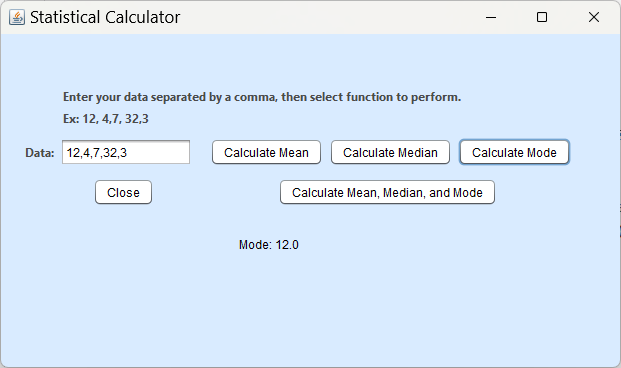

[Back to Portfolio](./)

Statistics Calculator
===============

-   **Class: CSCI 325** 
-   **Grade: A** 
-   **Language(s): Java** 
-   **Source Code Repository:** [/lostinlaland/statisticsCalculator325](https://github.com/lostinlaland/statisticsCalculator325)  
    (Please [email me](mailto:lakirbymail.com?subject=GitHub%20Access) to request access.)

## Project description

Data is entered, separated by commas, into the input box; the operation selected by the user is performed and the result is returned to the screen. If the user selects the "Mean" button then the values are added together and divided by the number of values. If the user selects the "Median" button then the middle value when ordered from least to greatest is returned. If there are an even number of values then the middle two are added together and divided by two, and then returned to the user. When the "Mode" button is selected the value that occurs most often in the input is returned. If no value is more frequent then the first value entered is returned.

## How to compile and run the program

How to run the program.

```bash
cd ./dir
java -jar "statisticsCalculator325.jar" 
```

## UI Design

This program allows the user to enter comma separated numbers and select to have the mean, median, mode, or all three functions performed on the data. The output is then displayed to the screen.


  
Fig 1. The launch screen

  
Fig 2. Example output after selecting Mean.

  
Fig 3. Example output after selecting Median.

  
Fig 4. Example output after selecting Mode.


[Back to Portfolio](./)
