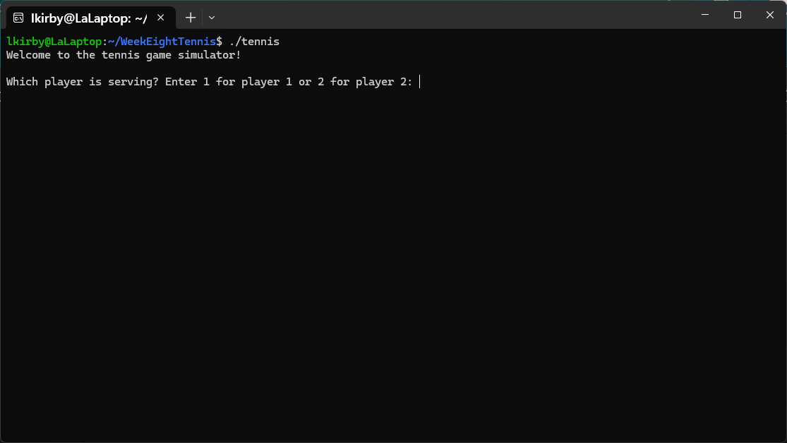
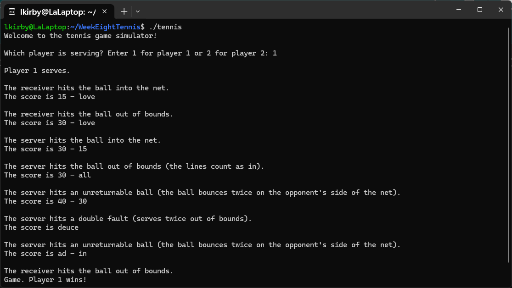
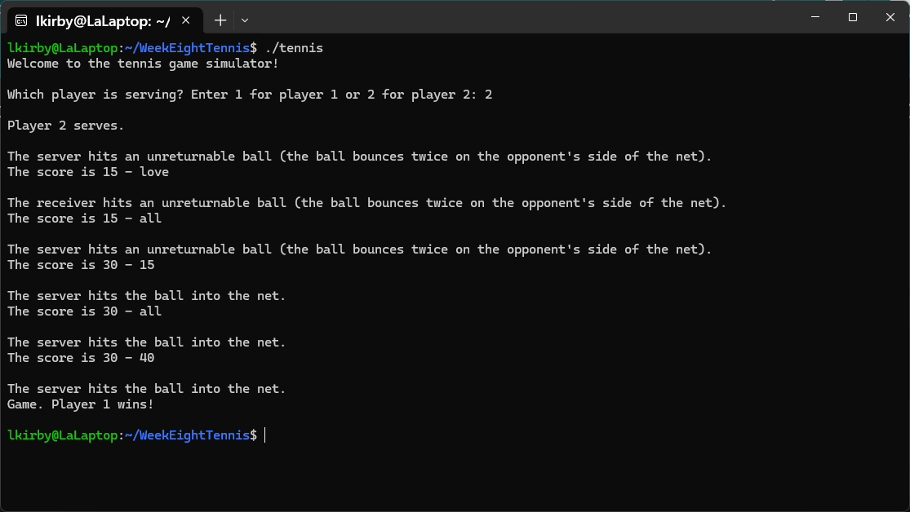

[Back to Portfolio](./)

Tennis Game
===============

-   **Class: CSCI 325** 
-   **Grade: A** 
-   **Language(s): C++** 
-   **Source Code Repository:** [/lostinlaland/statisticsCalculator325](https://github.com/lostinlaland/tennisGame)  
    (Please [email me](mailto:lakirbymail.com?subject=GitHub%20Access) to request access.)

## Project description

When the program is ran in the terminal, the user will be prompted to enter '1' or '2' to select which player will serve first in the simulated game. From there the program will make a series of decisions, with the potential to change each time the program is run, that determine the outcome of the game. When the program has made the decisions it outputs them to the screen along with the associated scores for each player. The final line of the output tells the user that the game is over and which player was the winner.

How to compile and run the program.

```bash
cd ./tennisGame
g++ tennisGame.cpp -o tennis
./tennis
```

## UI Design

This program allows the user to choose whether Player 1 or Player 2 serves first in a simulated tennis match. It then outputs the details of the server and updated score. When a player's score reaches 60 the game ends and the winner is announced.

  
Fig 1. The Start Menu screen

  
Fig 2. Simulated game with Player 1 serving first.

  
Fig 3. Simulated game with Player 2 serving first.


[Back to Portfolio](./)
