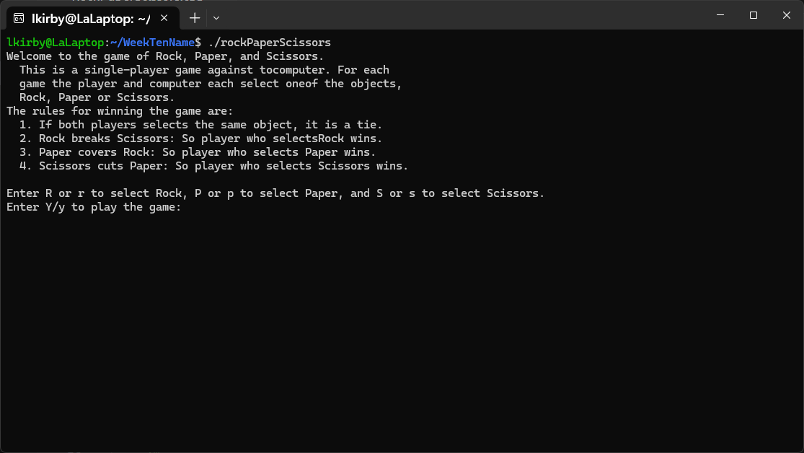
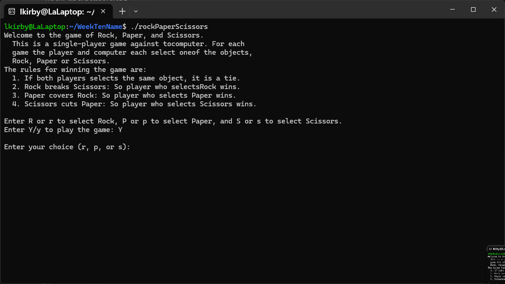
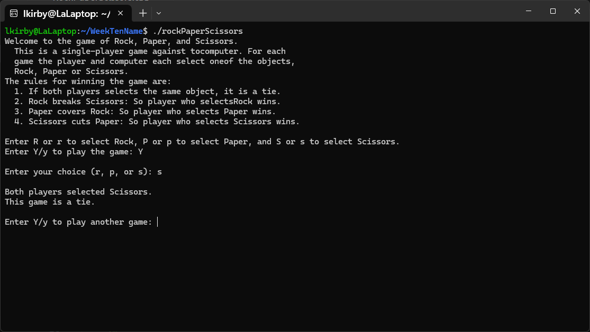
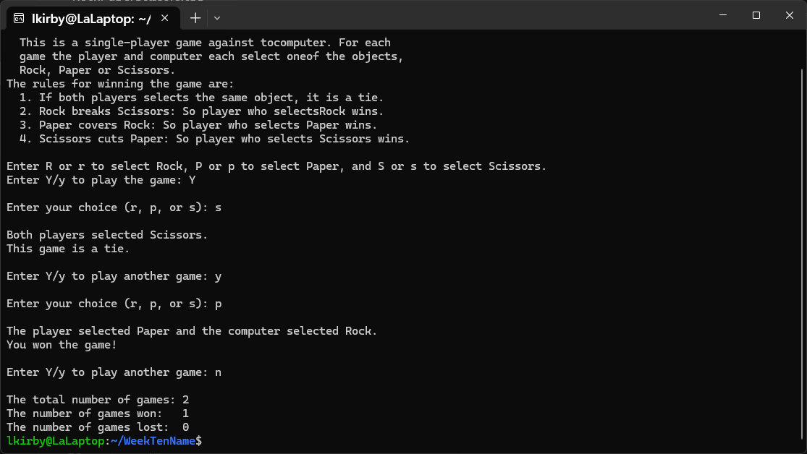
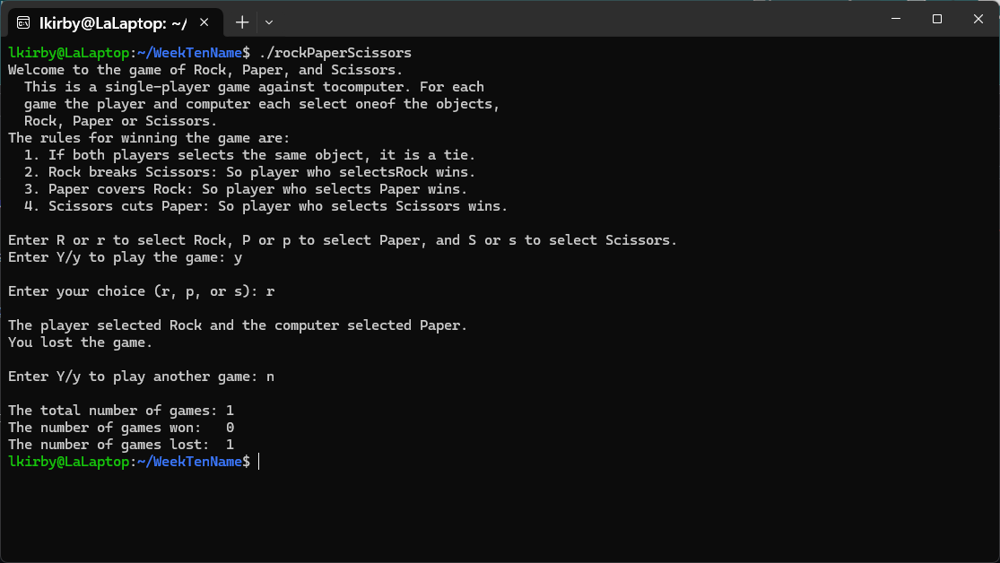

[Back to Portfolio](./)

Rock, Paper, Scissors Game Simulation
===============

-   **Class: CSCI 325** 
-   **Grade: A** 
-   **Language(s): C++** 
-   **Source Code Repository:** [/lostinlaland/rockPaperScissors](https://github.com/lostinlaland/rockPaperScissors)  
    (Please [email me](mailto:lakirbymail.com?subject=GitHub%20Access) to request access.)

## Project description

The program begins with an explanation as to what the game is as well as the rules for the rock, paper, scissors. The user will be promted to enter either 'y' or 'Y' to begin the game. If anything other than these two values are given by the user, the game will immediately end, provide the number of games played, the number of games won, the number of games lost, and the number of games tied before ending the program. If 'y' or "Y' is entered the user will be prompted to enter 'r' for rcok, 'p' for paper, or 's' for scissors. After receiving valid input the program will randomly choose which of the three options an "opponent" would choose and then output the result of game. The program will continue to prompt for and play another game as long as valid inputs are given.

## How to compile and run the program

How to compile and run the program.

```bash
cd ./rockPaperScissors
g++ rockPaperScissors.cpp -o rockPaperScissors
./rockPaperScissors
```

## UI Design

This program allows the user to simulate a game of rock, paper, scissors against an "opponent" which is the program itself. The user inputs valid data to begin the game and chooses to play either rock, paper, or scissors. The program will then choose a value to compare and the result is displayed. The rules governing the game are that rock beats scissors, paper beats rock, and scissors beats paper. When the user chooses to end the games a final break down of the games played, lost, and won is displayed.

  
Fig 1. The starting screen.

  
Fig 2. View of user being prompted to enter their choice after initiating a game.

  
Fig 3. View of round resulting in a tie after choosing scissors.

  
Fig 4. View of round resulting in a win after choosing paper and ending the program.


Fig 5. View of game resulting in a loss after choosing rock and ending the program


[Back to Portfolio](./)
